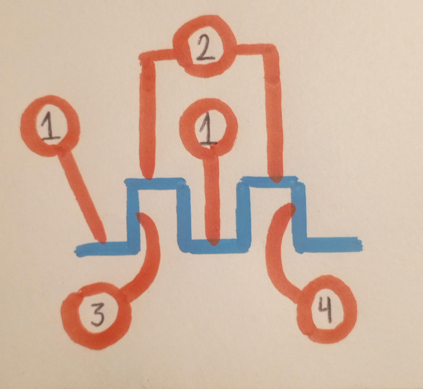
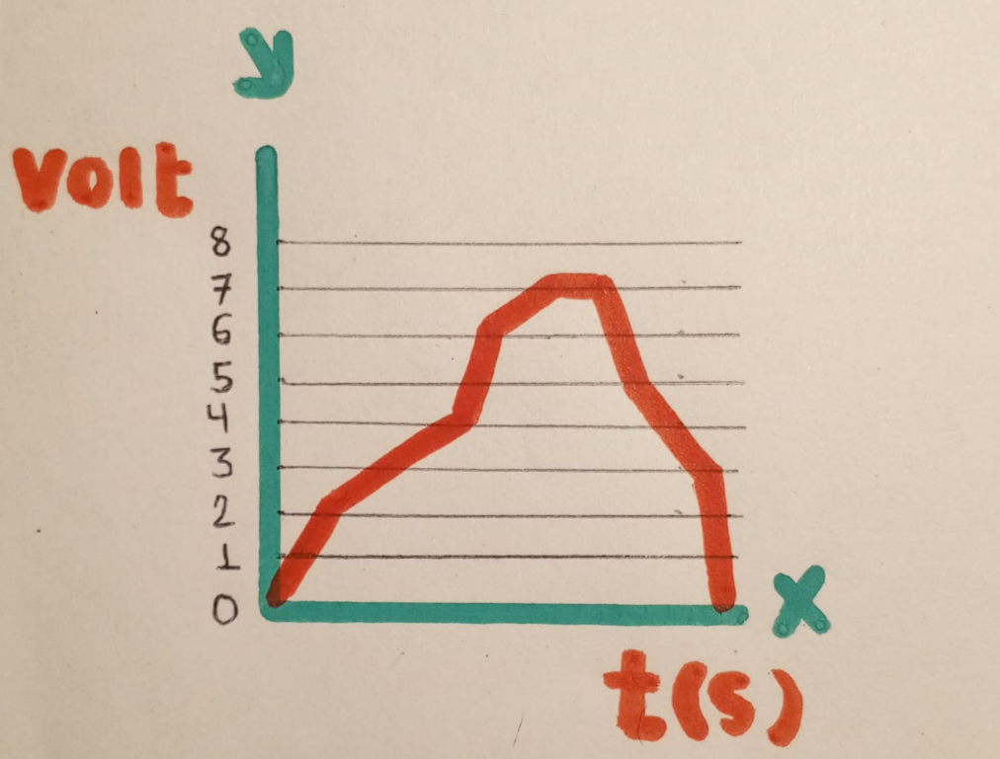

# Bases numericas
El objetivo de esta clase se basa en identificar los dos tipos de señales que hay, para luego detallar sus caracteristicas como; magnitudes y formas, utilizando un lenguaje tecnico, el cual nos permita relacionarnos de manera mas eficaz con el tema.

## 1. Señales digitales:
La señal digital es un tipo de señal utilizada en electronica digital, con la finalidad de representar informacion en forma binaria, sea en dos estados puntuales. Este tipo de señal maneja dos categorias en cuanto a niveles de voltaje o corriente, estos son; nivel alto y nivel bajo, representados por binarios 0 y 1, estos niveles acatan al tipo de tecnologia que se use, por ejemplo en logica TTL, 1 podria estar entre 2v y 5v y 0 entre 0v y 0.8v.

### 1.1 Representacion grafica:

### 1.2 Magnitudes digitales:
Las señales digitales representan magnitudes moderadas, en otras palabras, valores que solo pueden estar en ciertos niveles, enfatizando lo anterior dicho, estos valores habitualmente se limitan en bajo y alto, 0 o 1, a continuacion estudiaremos las magnitudes comunes de la señal digital.

#### 1.2.1 Magnitudes comunes de la señal digital:
**Estados de voltaje:** 
>Como se recalco anteriormente una señal digital varia entre dos niveles de voltaje, un nivel bajo 0v representando 0, y un nivel alto 3.3v representando 1

**Frecuencia de cambio:** 
>Las señales digitales cambian de estado en un lapso discreto, determinados por el sistema, lo que define cuando ocurre la transicion entre 0 y 1

##### 1.2.2 Ejemplos de señales digitales en la vida cotidiana:
Todos los dispositivos digitales, como una simple computadora, utilizan señales digitales para procesar y almacenar informacion, los datos dentro de una computadora son secuencias de bits entre 0s y 1s y las magnitudes son discretas.
El ejemplo que se planteo en la clase hablaba de un reproductor CD el cual tenia almacenados datos digitales "binarios", estos eran convertidos de digital a analoga para luego pasar por el amplificador lineal y ser reproducidos en el altavoz. 

### 1.3 Formas de onda digital:
Las formas de onda representan como permuta una señal, en este caso la forma de la onda digital se caracteriza por tener transiciones bruscas entre los valores binarios bien definidos, no hay valores intermedios, y las señales cambian instantaneamente de un nivel a otro.
**Ejemplo**
>La señal enviada desde un teclado cuando presionas una tecla es una forma de onda digital que pasa de 0 "no presionado" a 1 "presionado".

## 2. Señal analoga:
La señal analoga es un tipo de señal utilizada en electronica digital, para representar aquellas señales que pueden acaparar un rango continuo de valores. En comparacion con la señal digital, que solo puede estar en dos estados 1 o 0, la señal analoga puede cambiar en funcion de tiempo y tener cualquier valor dentro de un rango determinado.

### 2.1 Representacion grafica:

### 2.2 Magnitudes analogas:
La señal analoga expone una magnitud fisica que varia continuamente en el transcurso del tiempo, estas magnitudes pueden tomar cualquier valor, como se recalco anteriormente, a continuacion estudiaremos las magnitudes comunes de la señal analoga.

#### 2.2.1 Magnitudes comunes de la señal analoga:
**Voltaje:** 
>Variacion constante en la señal de salida de un dinamo, generador o sensor.

**Corriente:** 
>Cambio constante y progresivo en el flujo de electrones.

**Frecuencia:** 
>Cambios en la frecuencia de una onda.

**Amplitud:** 
>La magnitud de la altura de una onda sonora o electromagnetica.

##### 2.2.2 Ejemplos de señales analogas en la vida cotidiana:
La voz humana es un ejemplo sencillo de señal análoga. Al hablar se producen ondas sonoras de diferente amplitud que seria el volumen y frecuencia que seria el tono, estas varían de forma continua.
El ejemplo que se planteo en la clase, es el de un microfono el cual conduce señal de audio, pasando por un amplificador lineal, el cual aumenta las ondas, finalmente reproducidas por el Altavoz.

### 2.3 Formas de onda analoga:
Las formas de onda representan como permuta una señal, en este caso la forma de la onda analoga varia de manera continua y suave en el transcurso del tiempo, puesto que los cambios en su magnitud no son abruptos, esto implica que pueden tomar un valor al azar dentro de un rango determinado.
**Ejemplo:**
>Una señal de audio en un micrófono es una forma de onda análoga que varía constantemente en función del volumen y la frecuencia de la voz.
