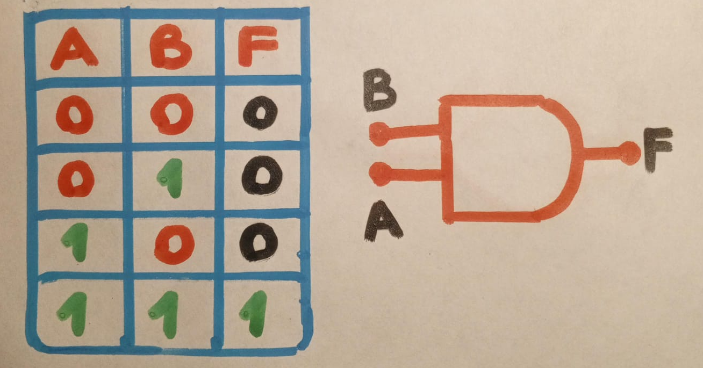
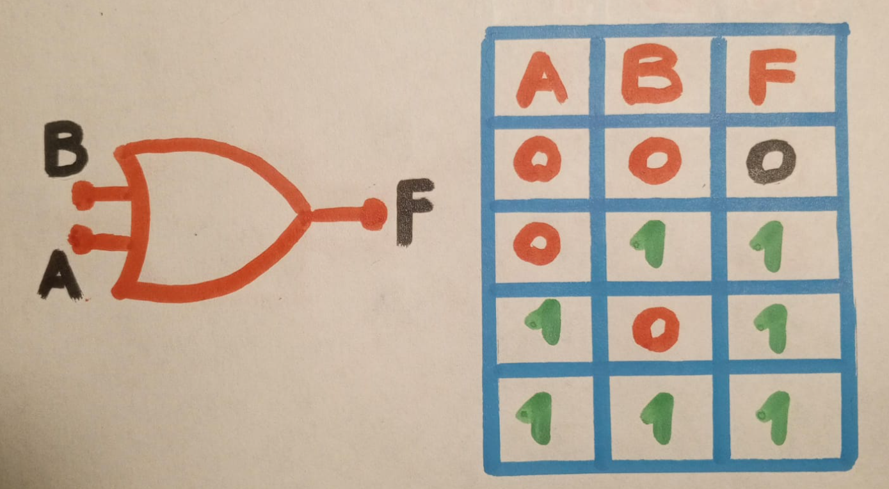
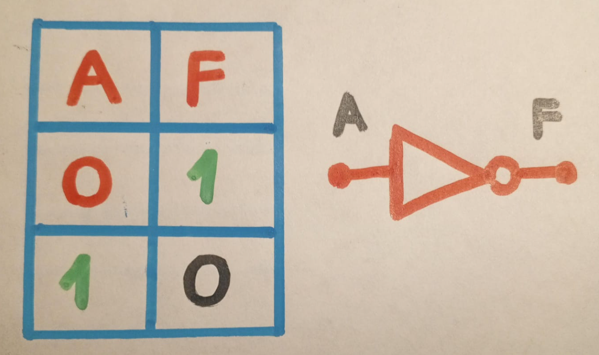
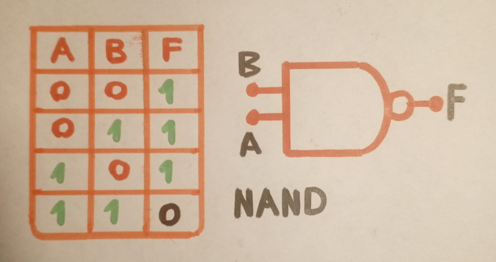
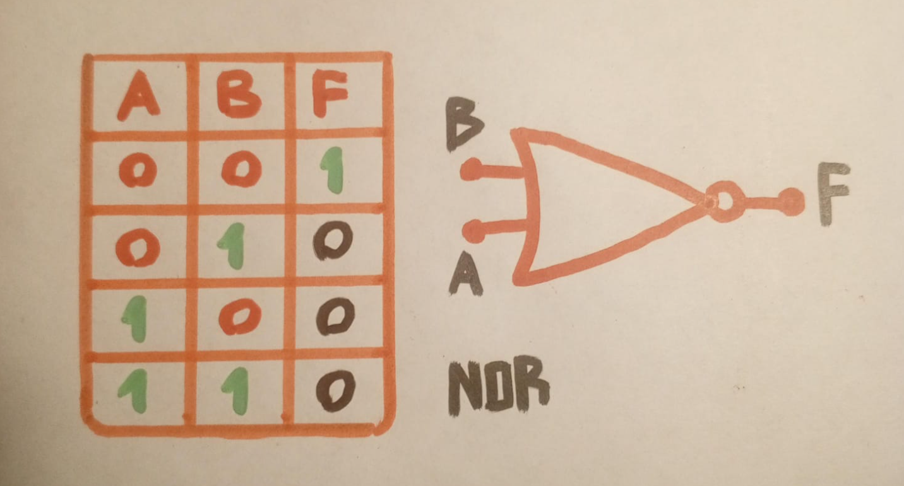
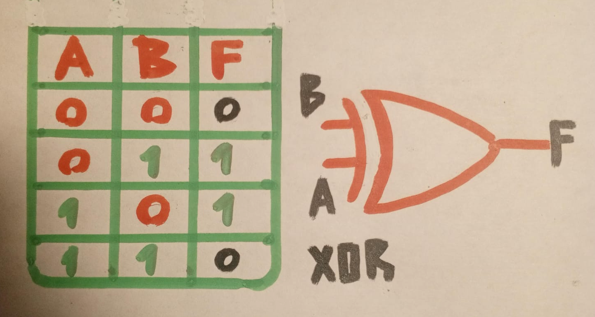
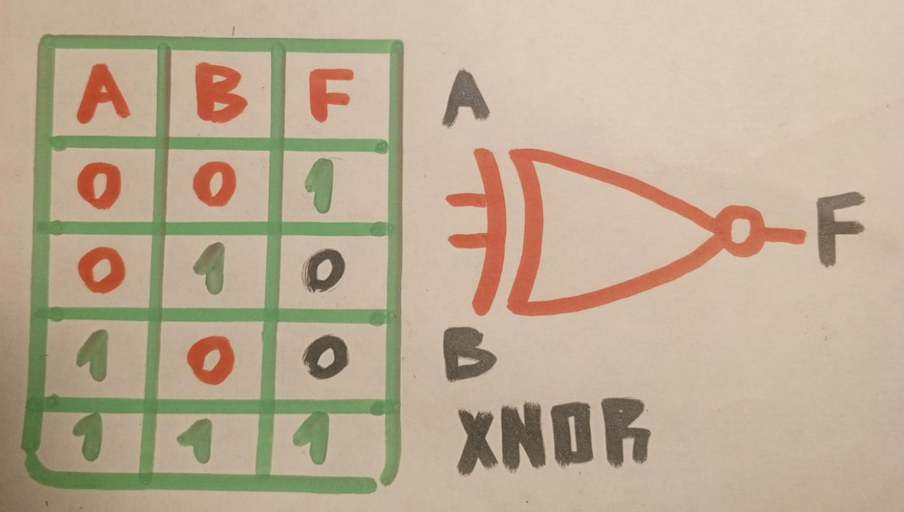

# Compuertas logicas y algebra boole
El título de cada clase, correspondiente al tema general que se trabaje en clase. Siempre después de cada título de clase, redactar una breve introducción (mínimo un párrafo) que de una mirada general al tema
## 1. Variables binarias:
Las variables binarias son aquellas que solo pueden tomar dos valores: 0 y 1. Estos valores unicamente representan dos estados, como "encendido" y "apagado" o "falso" y "verdadero", en los sistemas digitales, toda informacion y los procedimientos se basan en esas dos combinaciones.

## 2. Operaciones logicas:
Las operaciones logicas se realizan entre variables binarias y generan un resultado basado en reglas especificas, las tres operaciones basicas son:
### 2.1 And:
>El resultado es 1 solo si ambas variables de entrada son 1.

|**A**|**B**|**F**|
|-----|-----|-----|
|  0  |  0  |  0  |
|  0  |  1  |  1  |
|  1  |  0  |  1  |
|  1  |  1  |  1  |

### 2.1.2 Apuntes de la clase

### 2.2 or:
>El resultado es 1 si al menos una de las variables de entrada es 1.

|**A**|**B**|**F**|
|-----|-----|-----|
|  0  |  0  |  0  |
|  0  |  1  |  0  |
|  1  |  0  |  0  |
|  1  |  1  |  1  |

### 2.2.2 Apuntes de la clase

### 2.3 Not:
>Invierte el valor de la variable de entrada, si la entrada es 0, el resultado es 1 y viceversa.

|**A**|**F**|
|-----|-----|
|  0  |  1  |
|  1  |  1  |

### 2.3.2 Apuntes de la clase

## 3. Logica Binaria:
### 3.1 Variables binarias:
Como se recalco anteriormente, son variables que solo pueden tener dos valores 0 o 1, y son de suma importancia para la logica digital. Estas variables se utilizan para representar y procesar informacion en circuitos digitales.
### 3.2 Operaciones logicas:
Las operaciones mencionadas anteriormente; and or y not son los bloque esenciales para diseñar circuitos digitales. Si se llegan a combinar varias operaciones logicas se pueden construir circuitos complejos.

## 4. Compuertas logicas:
Las compuertas logicas son implementaciones fisicas de las operaciones logicas, cada una de las compuertas tiene uno o mas valores de entrada y genera una salida basada en una operacion logica en particular, a continuacion podra apreciar algunas de las compuertas mas importantes:

### 4.1 Nand:
Las compuertas Nand es una composicion de las operaciones Not y And, su salida es 0 solo si ambas entradas son 1, en cualquier otro caso, la salida sera 1. Es una de las compuertas principales ya que, con solo compuertas Nand, se pueden implementar cualquier otra operacion logica.

|**A**|**B**|**F**|
|-----|-----|-----|
|  0  |  0  |  1  |
|  0  |  1  |  1  |
|  1  |  0  |  1  |
|  1  |  1  |  0  |

### 4.1.1 Apuntes de clase:

### 4.2 Nor:
La compuerta Nor es una combinacion de Not y Or. Su salida sera 1 unicamente si ambas son 0, parecido a Nand, cualquier circuito logico puede añadirse utilizando compuertas Nor.

|**A**|**B**|**F**|
|-----|-----|-----|
|  0  |  0  |  1  |
|  0  |  1  |  0  |
|  1  |  0  |  0  |
|  1  |  1  |  0  |

### 4.2.1 Apuntes de clase:

### 4.3 Or Exclusiva Xor
La compuerta Xor o Or exclusiva genera una salida de 1 si solo una de las entradas es 1, pero no ambas. Es muy util en circuitos donde se necesita detectar diferencias entre las entradas.

|**A**|**B**|**F**|
|-----|-----|-----|
|  0  |  0  |  0  |
|  0  |  1  |  1  |
|  1  |  0  |  1  |
|  1  |  1  |  0  |

### 4.3.1 Apuntes de clase:

### 4.4 Nor Exclusiva Xnor
La compuerta Xnor o Nor exclusiva es todo lo contrario de la compuerta Xor. Produce una salida de 1 si ambas entradas son iguales, ya sea 0,0 o 1,1. Es bastante utilizada en operaciones de comparacion de igualdad.

|**A**|**B**|**F**|
|-----|-----|-----|
|  0  |  0  |  1  |
|  0  |  1  |  0  |
|  1  |  0  |  0  |
|  1  |  1  |  1  |

### 4.4.1 Apuntes de clase:

## 5 Circuito integrado:
Un circuito integrado "CI" es un grupo de compuertas logicas interconectadas en un solo chip que puede hacer multiples operaciones logicas y funciones. Los circuitos integrados son la base de los componentes electronicos mas complejos como procesadores, memorias y controladores. 
> Dentro de estos CI, se encuentran las compuertas logicas que hemos mencionado, las cuales estan integradas para formar estructuras mas avanzadas.
